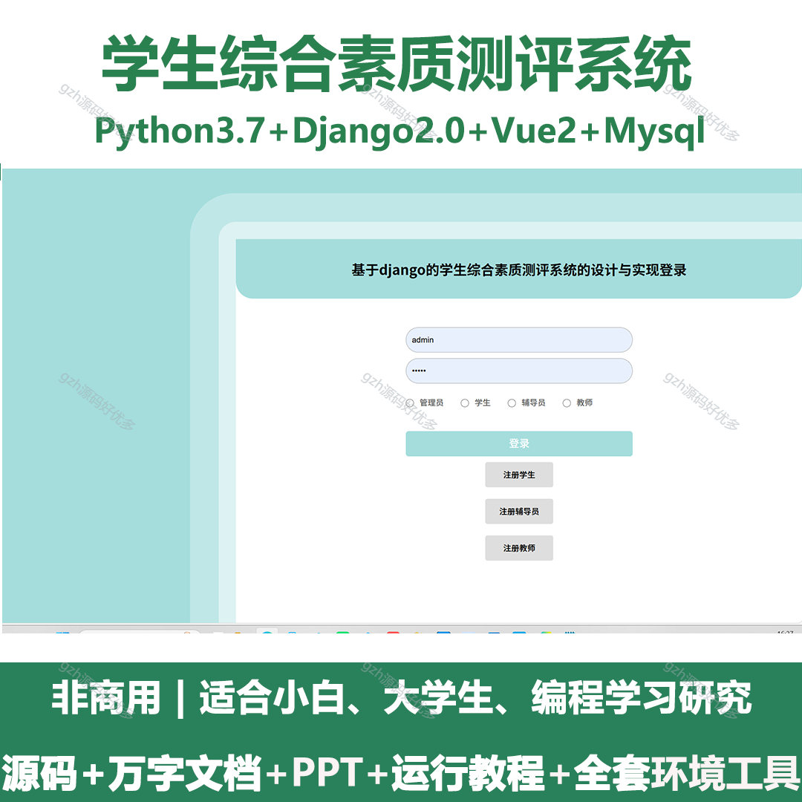
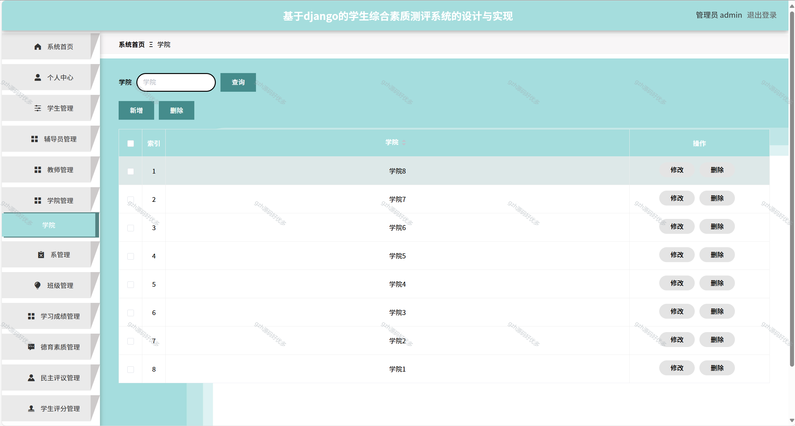
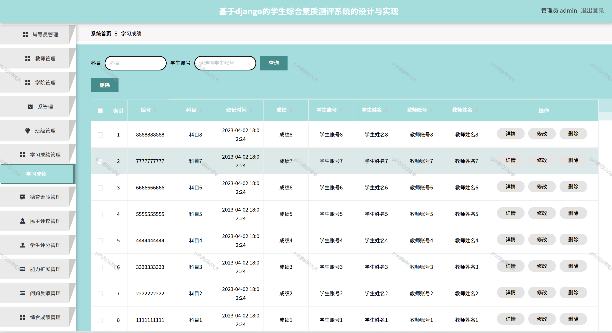
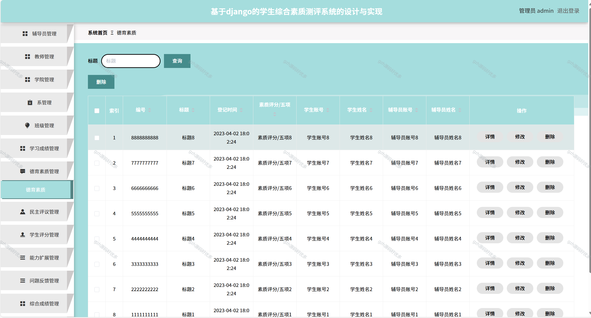
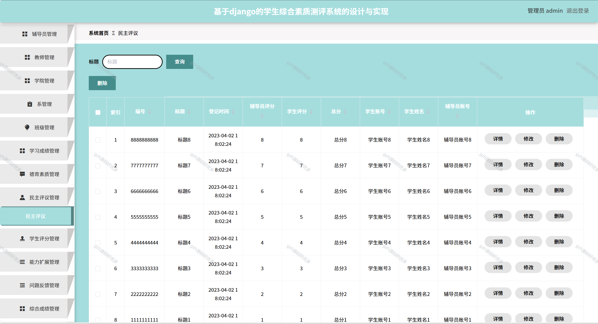
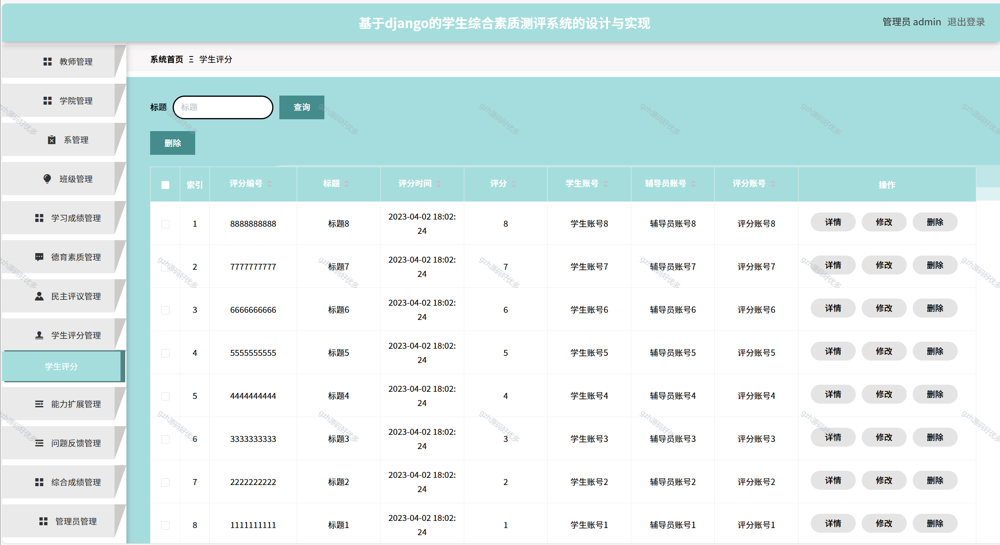
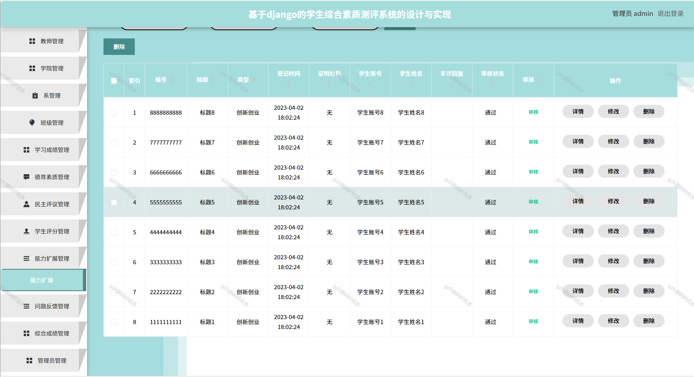
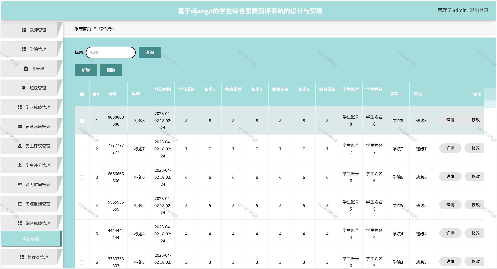
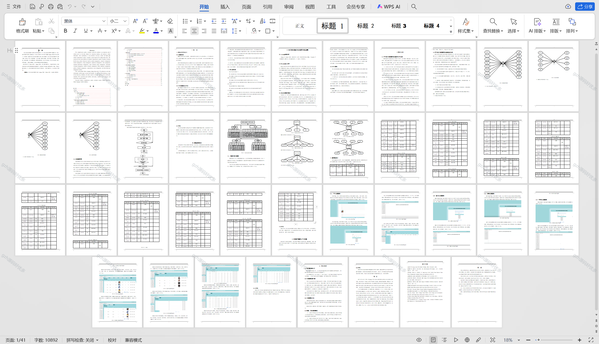

# python064
python064基于Python+Django的学生综合素质测评系统+LW+PPT
 
## 查看主页获取源码

### 一、关键词
学生全面素质评估系统，学生整体素养测评系统，学生综合素质考评系统

### 二、作品包含
源码+数据库+万字文档+PPT+全套环境和工具资源+本地部署教程

### 三、项目技术
前端技术：Vue2.0、Element-ui
后端技术：Python3.7、Django2.0

### 四、运行环境（以下版本亲测，其他版本兼容性请自行测试）
开发工具：PyCharm + VSCODE

数据库：MySQL5.7（最低要5.7版本）

数据库管理工具：Navicat10+

Python：Python3.7

前端Nodejs：14

浏览器：谷歌浏览器

### 五、项目介绍
项目编号：python064

学生综合素质测评系统是学校中重要的一环，学生综合素质测评是辅导员、学生、教师获取信息的主要渠道。于是经过考虑之后决定开发基于django框架设计与实现了一款简洁、轻便的学生综合素质测评系统。本系统解决了学生综合素质测评的主要问题，包括以下多个功能模块：学生管理、辅导员管理、教师管理、学院管理、系管理、班级管理、学习成绩管理、德育素质管理、民主评议管理、学生评分管理、能力扩展管理、问题反馈管理、综合成绩管理等功能管理模块。
系统具有良好的易用性和安全性，系统功能齐全，可以满足学生需求。

### 六、运行截图

